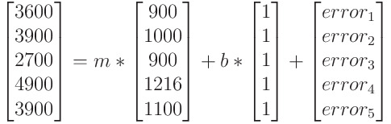

# [Matrix Representation of Linear Regression](https://www.codecademy.com/courses/linear-regression-mssp/articles/matrix-representation-of-linear-regression)

Learn about the matrix representation of the regression problem.

## Introduction

In this article we will walk through the matrix representation of the regression problem. 
While understanding the underlying math is not necessary in order to fit a regression model, 
it is useful in diagnosing problems, improving models, and working with new libraries and technologies.

## Data to Matrix transformation: Simple Linear Regression

A numerical matrix is simply a rectangular array of numbers. 
It is not difficult to see how a DataFrame already looks a lot like that. 
As an example, let’s look at a dataset from the [StreetEasy dataset](https://github.com/Codecademy/datasets/tree/master/streeteasy), 
which contains data about housing rentals in Brooklyn.
```py
import pandas as pd

df = pd.read_csv('brooklyn.csv')

#columns we're interested in
bk = df[[
    ‘rent’, 
    ‘bedrooms’,  
    ‘bathrooms’, 
    ‘size_sqft’, 
    ‘min_to_subway’, 
    ’building_age_yrs’, 
    ‘has_washer_dryer’
]]

print(bk.head(5))
```
|  |	rent |	bedrooms |	bathrooms |	size_sqft |	min_to_subway |	building_age_yrs |	has_washer_dryer |
| --- | --- | --- | --- | --- | --- | --- | --- |
| 0 |	3600 |	3.0 |	2 |	900  |	4 |	15 |	0 |
| 1 |	3900 |	3.0 |	2 |	1000 |	4 |	8  |	0 |
| 2 |	2700 |	2.0 |	1 |	900  |	4 |	96 |	0 |
| 3 |	4900 |	1.0 |	1 |	1216 |	6 |	88 |	0 |
| 4 |	3900 |	0.0 |	1 |	1100 |	3 |	85 |	0 |

A quick glance at the dataset tells us that there is more than one variable that might be predictive of rental price. 
For starters, let’s focus on the apartment size. 
Suppose we fit the date with the following simple linear regression model with **slope `m`** and **intercept `b`**:
<p align="center">
    <em>rent = m ∗ size_sqft + b + error</em>
</p>
This equation is actually short-hand for a large number of equations — one for each apartment in our dataset. 
The first five equations (corresponding to the first five rows of the dataset) are:
<div align="center">
    <em>3600 = m ∗ 900 + b + error<sub>1</sub></em><br />
    <em>3900 = m ∗ 1000 + b + error<sub>2</sub></em><br />
    <em>2700 = m ∗ 900 + b + error<sub>3</sub></em><br />
    <em>4900 = m ∗ 1216 + b + error<sub>4</sub></em><br />
    <em>3900 = m ∗ 1100 + b + error<sub>5</sub></em><br />
</div>
When we fit this linear regression model, we are trying to find the values of *m* and *b* such that the sum of the squared error terms above 
*(eg., error_1^2 + error_2^2 + error_3^2 + error_4^2 + error_5^2 + ….)* is minimized.  

<p></p>

We create 
* a column matrix of rents (the outcome variable), 
* a column matrix of apartment sizes (the predictor variable) 
* and a column matrix of the errors

and rewrite the five equations above as one matrix equation:
<div align="center">
    
</div>
We can do so because when we add two matrices of the same size, 
an element in one matrix gets added to the corresponding element in the other matrix that occupies the same position (row, column). 
Also, when we multiply a matrix by a constant, each element gets multiplied by it. So:


