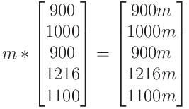
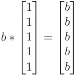
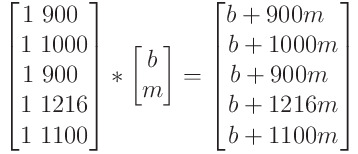
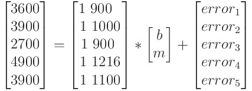
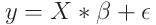
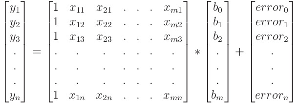
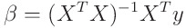

# [Matrix Representation of Linear Regression](https://www.codecademy.com/courses/linear-regression-mssp/articles/matrix-representation-of-linear-regression)

Learn about the matrix representation of the regression problem.

## Introduction

In this article we will walk through the matrix representation of the regression problem. 
While understanding the underlying math is not necessary in order to fit a regression model, 
it is useful in diagnosing problems, improving models, and working with new libraries and technologies.

## Data to Matrix transformation: Simple Linear Regression

A numerical matrix is simply a rectangular array of numbers. 
It is not difficult to see how a DataFrame already looks a lot like that. 
As an example, let’s look at a dataset from the [StreetEasy dataset](https://github.com/Codecademy/datasets/tree/master/streeteasy), 
which contains data about housing rentals in Brooklyn.
```py
import pandas as pd

df = pd.read_csv('brooklyn.csv')

#columns we're interested in
bk = df[[
    ‘rent’, 
    ‘bedrooms’,  
    ‘bathrooms’, 
    ‘size_sqft’, 
    ‘min_to_subway’, 
    ’building_age_yrs’, 
    ‘has_washer_dryer’
]]

print(bk.head(5))
```
|  |	rent |	bedrooms |	bathrooms |	size_sqft |	min_to_subway |	building_age_yrs |	has_washer_dryer |
| --- | --- | --- | --- | --- | --- | --- | --- |
| 0 |	3600 |	3.0 |	2 |	900  |	4 |	15 |	0 |
| 1 |	3900 |	3.0 |	2 |	1000 |	4 |	8  |	0 |
| 2 |	2700 |	2.0 |	1 |	900  |	4 |	96 |	0 |
| 3 |	4900 |	1.0 |	1 |	1216 |	6 |	88 |	0 |
| 4 |	3900 |	0.0 |	1 |	1100 |	3 |	85 |	0 |

A quick glance at the dataset tells us that there is more than one variable that might be predictive of rental price. 
For starters, let’s focus on the apartment size. 
Suppose we fit the date with the following simple linear regression model with **slope `m`** and **intercept `b`**:
<h3 align="center">
    <em>
        rent = m ∗ size_sqft + b + error
    </em>
</h3>
This equation is actually short-hand for a large number of equations — one for each apartment in our dataset. 
The first five equations (corresponding to the first five rows of the dataset) are:
<h3 align="center">
    <em>3600 = m ∗ 900 + b + error<sub>1</sub></em><br />
    <em>3900 = m ∗ 1000 + b + error<sub>2</sub></em><br />
    <em>2700 = m ∗ 900 + b + error<sub>3</sub></em><br />
    <em>4900 = m ∗ 1216 + b + error<sub>4</sub></em><br />
    <em>3900 = m ∗ 1100 + b + error<sub>5</sub></em><br />
</h3>
When we fit this linear regression model, we are trying to find the values of *m* and *b* such that the sum of the squared error terms above 
*(eg., error_1^2 + error_2^2 + error_3^2 + error_4^2 + error_5^2 + ….)* is minimized.  

<p></p>

We create 
* a column matrix of rents (the outcome variable), 
* a column matrix of apartment sizes (the predictor variable) 
* and a column matrix of the errors

and rewrite the five equations above as one matrix equation:
<div align="center">
    
</div>
We can do so because when we add two matrices of the same size, 
an element in one matrix gets added to the corresponding element in the other matrix that occupies the same position (row, column). 
Also, when we multiply a matrix by a constant, each element gets multiplied by it. So:
<div align="center">
    
</div>
<div align="center">
    and similarity:<br />
    
</div>
We can simplify this even further by combining the column of 1’s with the column of the apartment sizes (the predictor variable) into a two-column matrix. 
This works because of the following matrix algebra (this is how matrix multiplication works!):
<div align="center">
    <br />
    
</div>
Therefore, the most simple version of our matrix equation look like this:
<div align="center">
    <br />
    
</div>

In total we have 4 matrices in this equation:
* A one-column matrix on the left hand side of the equation containing the **outcome variable** values (rent here) that we will call **y**
* A two-column matrix on the right hand side that contains a **column of 1’s** and a **column of the predictor** variable values (size_sqft here) that we will call **X**. This is also known as the **design matrix** or **X matrix**.
* A one-column matrix containing the **intercept b** and the **slope m**, i.e, the **solution matrix** that we will denote by the Greek letter **beta**. The goal of the regression problem is to evaluate this matrix.
* A one-column matrix of the residuals or errors, the **error matrix**. The regression problem can be solved by minimizing the sum of the squares of the elements of this matrix. The error matrix will be denoted by the Greek letter epsilon.

Using these shorthands, the matrix representation of the regression equation is thus:
<div align="center">
    <br />
    
</div>

## Multiple Linear Regression

Now there are more factors than the size of an apartment that likely influence its rental price. 
If we want to regress on more than one of these variables, our regression equation will look as follows:
<h3 align="center">
    <em>
        rent = b<sub>0</sub> + b<sub>1</sub> * size_sqft + b<sub>2</sub> * min_to_subway + b<sub>3</sub> * has_washer_dryer + ... + error
    </em>
</h3>
We are now in the territory of Multiple Linear Regression models. 
If we denote the different predictor variables by *{x1, x2, x3, …, xm}*, their corresponding slopes by *{b1,b2,b3,.., bm}* and the intercept by *b0*, 
we can write a more general form of the above equation:
<h3 align="center">
    <em>
        y = b<sub>0</sub> + b<sub>1</sub> * x<sub>1</sub> + b<sub>2</sub> * x<sub>2</sub> + ... + b<sub>m</sub> * x<sub>m</sub> + error
    </em>
</h3>
If our dataset has n data points, we will have n such equations:
<h3 align="center">
    <em>
        y<sub>1</sub> = b<sub>0</sub> + b<sub>1</sub> * x<sub>11</sub> + b<sub>2</sub> * x<sub>21</sub> + ... + b<sub>m</sub> * x<sub>m1</sub> + error<sub>1</sub>
    </em>
    <br />
    <em>
        y<sub>2</sub> = b<sub>0</sub> + b<sub>1</sub> * x<sub>12</sub> + b<sub>2</sub> * x<sub>22</sub> + ... + b<sub>m</sub> * x<sub>m2</sub> + error<sub>2</sub>
    </em>
    <br />
    <em>
        y<sub>3</sub> = b<sub>0</sub> + b<sub>1</sub> * x<sub>13</sub> + b<sub>2</sub> * x<sub>23</sub> + ... + b<sub>m</sub> * x<sub>m3</sub> + error<sub>3</sub>
    </em>
    <br />
        ...
    <br />
    <em>
        y<sub>n</sub> = b<sub>0</sub> + b<sub>1</sub> * x<sub>1n</sub> + b<sub>2</sub> * x<sub>2n</sub> + ... + b<sub>m</sub> * x<sub>mn</sub> + error<sub>n</sub>
    </em>
</h3>
The matrix formulation for multiple linear regression thus looks as follows:
<div align="center">
    <br />
    
</div>

We still have the same 4 matrices that we had in the case of simple linear regression:
* a column matrix **y** of the **outcome variable** values
* the **design matrix X** which has a **column of 1’s** and a **column for each predictor** variable
* a column matrix of the **intercept** and **slopes**, the **solution matrix**
* the **error matrix**

In its condensed form the equation is exactly the same as the one we saw in the case of simple linear regression:
<div align="center">
    <br />
    
</div>

To solve the regression problem, we need to calculate the *beta* matrix such that the sum of the squared errors is minimized. 
This is the **Ordinary Least Squares (OLS)** method. 
We can solve this problem using a combination of calculus and matrix algebra. 
Without going too deep into the math, the solution to this problem looks like this (we’ll explain some of the notation later in this article!):
<div align="center">
    <br />
    
</div>

## Regression Solution using the Matrix Method

The **y** and **X** matrices discussed so far are exactly the same as the inputs to a regression model run using **`statsmodels`**‘s **`sm.OLS`** function. 
Let’s build a multiple regression model where we regress the rental price on 
* the age of the building, 
* time taken to get to the nearest subway 
* and whether the building has a washer-dryer unit or not. 

We can fit this model in two steps using `patsy`, which allows us to examine the design matrix:
```py
from patsy import dmatrices

y, X = dmatrices(
    'rent ~ building_age_yrs + min_to_subway + has_washer_dryer', 
    bk, 
    return_type = 'dataframe'
)

print(X)
```
Output:
```py
     Intercept  building_age_yrs  min_to_subway  has_washer_dryer
0           1.0              15.0            4.0               0.0
1           1.0               8.0            4.0               0.0
2           1.0              96.0            4.0               0.0
...         ...               ...            ...               ...
 
1011        1.0               5.0            1.0               0.0
1012        1.0             116.0            3.0               1.0
```
Note how `patsy` has already done the work of adding a column of 1’s for us! 
We’re
now ready to fit this data using the **`Ordinary Least Squares (OLS)`** Method:
```py
import statsmodels.api as sm

model = sm.OLS(y,X)
results = model.fit()

print(results.params, '\n', results.summary().extra_txt)
```
Output:
```py
Intercept           3696.170035
building_age_yrs      -5.465115
min_to_subway        -25.179742
has_washer_dryer     719.578411
dtype: float64
Notes:
[1] Standard Errors assume that the covariance matrix of the errors is correctly specified.
```
A quick examination of the results tell us:
* There is a negative slope for building age and minutes to the nearest subway.
* There is a high positive slope associated with having a washer-dryer and the intercept is comparable to the average rent of a Brooklyn apartment unit.

(The `extra_txt` attribute of the `summary` object usually appears at the bottom of the summary - there is nothing much to note here at the moment.)

Next, let’s use the matrix solution we saw earlier to calculate the coefficients. 
We’ll use `numpy`‘s matrix algebra methods to do all the math. 
Then, we can compare the slopes and intercept to what we calculated using `statsmodels`. 
First, let’s convert our X to a `numpy` matrix object:
```py
import numpy as np

np.set_printoptions( suppress = True )
X_matrix = np.matrix( X.to_numpy() )
print( X_matrix )
```
Output:
```py
[[  1.  15.   4.   0.]
 [  1.   8.   4.   0.]
 [  1.  96.   4.   0.]
 ...
 [  1. 117.   5.   0.]
 [  1.   5.   1.   0.]
 [  1. 116.   3.   1.]]
```
Let’s take a closer look at our solution equation:
<div align="center">
    <br />
    
</div>


