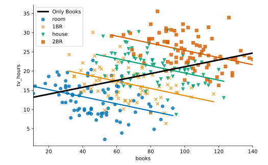

#### MULTIPLE LINEAR REGRESSION

# [Simpson's Paradox](https://www.codecademy.com/courses/linear-regression-mssp/lessons/stats-multiple-linear-regression/exercises/simpsons-paradox)

In the last exercise, we explored how a coefficient may change when additional predictors are added to a model. 
When adding predictors entirely reverses the sign of the coefficient, this is called **Simpson’s Paradox**: 
one model says the direction of the relationship is positive, while the other says it is negative.

Let’s look at a simple example of this with the fictional dataset `tv`. 
We’ll start by fitting a simple regression predicting weekly hours of television watched (`tv_hours`) from the number of books in the home (`books`).
```py
import statsmodels.api as sm
model0 = sm.OLS.from_formula(
    'tv_hours ~ books', 
    data = tv)
.fit()

print(model0.params)

# Output:
# Intercept    12.219967
# books         0.089078
```
The coefficient on `books` is positive: 
the model indicates that more books is associated with more weekly hours of television. 
Now, let’s add a categorical variable to the model that specifies type of home (`hometype`): 
* rented room, 
* one-bedroom apartment, 
* two-bedroom apartment, 
* or house.
```py
import statsmodels.api as sm
model1 = sm.OLS.from_formula(
    'tv_hours ~ books + hometype', 
    data = tv)
.fit()

print(model1.params)

# Output
# Intercept            22.952692
# hometype[T.2BR]      11.754848
# hometype[T.house]     5.878007
# hometype[T.room]     -5.880337
# books                -0.093223
```
This model leads to the opposite conclusion: 
the negative coefficient on `books` indicates that more books is associated with FEWER hours of television watched. 
How is this possible?

Let’s look at a scatter plot of `tv_hours` (y-axis) against `books` (x-axis) colored by `hometype`. 
This time we’ll allow `lmplot` to fit regression lines for each type of home by NOT setting `fit_reg` to `False`. 
We’ll also add the regression line for `model0`, which only has books as a predictor.
```py
import seaborn as sns
import matplotlib.pyplot as plt
 
# Scatter plot
sns.lmplot(
    x = 'books', 
    y = 'tv_hours', 
    hue = 'hometype', 
    palette = 'colorblind', 
    markers = ['o', 'x', 'v','s'], 
    ci = False, 
    legend = False, 
    data = tv
)
 
# Black line
plt.plot(
    tv.books, 
    model0.params[0] + model0.params[1] * tv.books, 
    color = 'black', 
    linewidth = 3, 
    label = 'Only Books'
)
 
plt.legend()
plt.show()
```



Scatter plot showing books on the x-axis and tv hours on the y-axis. 
Regression lines for each group of home-type show a negative relationship between tv hours and books. 
Meanwhile, the regression line for the model with just books shows a positive relationship.

Broadly, the points slope upward (black line), but the points slope downward within each `hometype` group (colored lines).

This could be because bigger homes mean more room for a larger book collection. 
Or maybe certain home types are associated with higher incomes, so people have more time and money for television. 
We can examine the pattern of association from the model, and possibly make good predictions from new data with it, but we can’t find out the cause from this type of analysis.
