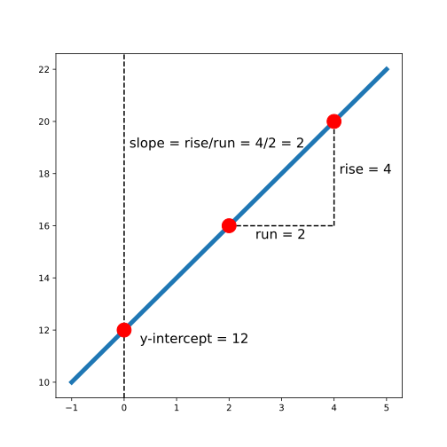
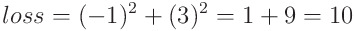

#### INTRODUCTION TO LINEAR REGRESSION

# [Introduction to Linear Regression](https://www.codecademy.com/courses/linear-regression-mssp/lessons/introduction-to-linear-regression/exercises/introduction-to-linear-regression)

Linear regression is a powerful modeling technique that can be used to understand the relationship between a quantitative variable and one or more other variables, 
sometimes with the goal of making predictions. 
For example, linear regression can help us answer questions like:
* What is the relationship between apartment size and rental price for NYC apartments?
* Is a mother’s height a good predictor of their child’s adult height?

The first step before fitting a linear regression model is exploratory data analysis and data visualization: is there a relationship that we can model? 
For example, suppose we collect heights (in cm) and weights (in kg) for 9 adults and inspect a plot of height vs. weight:
```py
plt.scatter(data.height, data.weight)
plt.xlabel('height (cm)')
plt.ylabel('weight (kg)')
plt.show()
```


Scatter plot showing a positive linear relationship between height and weight (people who are taller tend to weigh more)

When we look at this plot, we see that there is some evidence of a relationship between height and weight: people who are taller tend to weigh more. 
In the following exercises, we’ll learn how to model this relationship with a line. 
If you were to draw a line through these points to describe the relationship between height and weight, what line would you draw?

# [Equation of a Line](https://www.codecademy.com/courses/linear-regression-mssp/lessons/introduction-to-linear-regression/exercises/equation-of-a-line)

Like the name implies, LINEar regression involves fitting a line to a set of data points. 
In order to fit a line, it’s helpful to understand the equation for a line, which is often written as y = mx + b. 
In this equation:
* x and y represent variables, such as height and weight or hours of studying and quiz scores.
* b represents the y-intercept of the line. This is where the line intersects with the y-axis (a vertical line located at x = 0).
* m represents the slope. This controls how steep the line is. If we choose any two points on a line, the slope is the ratio between the vertical and horizontal distance between those points; this is often written as rise/run.

The following plot shows a line with the equation y = 2x + 12:



image showing a line with a point at the y-axis (a vertical line where the x-variable is equal to zero) labeled "y-intercept." 
The line also has two other points, which are connected by a horizontal and vertical dashed line, labeled "run" and "rise," respectively. 
The slope is calculated as rise/run which is equal to 2 in this example.

Note that we can also have a line with a negative slope. 
For example, the following plot shows the line with the equation y = -2x + 8:


image showing a line with a point at the y-axis (a vertical line where the x-variable is equal to zero) labeled "y-intercept." 
The line also has two other points, which are connected by a horizontal and vertical dashed line, labeled "run" and "rise," respectively. 
The slope is calculated as rise/run which is equal to -2 in this example.

# [Finding the "Best" Line](https://www.codecademy.com/courses/linear-regression-mssp/lessons/introduction-to-linear-regression/exercises/finding-the-best-line)

In the last exercise, we tried to eye-ball what the best-fit line might look like. 
In order to actually choose a line, we need to come up with some criteria for what “best” actually means.

Depending on our ultimate goals and data, we might choose different criteria; 
however, a common choice for linear regression is ordinary least squares (OLS). 
In simple OLS regression, we assume that the relationship between two variables x and y can be modeled as:


We define “best” as the line that minimizes the total squared error for all data points. 
This total squared error is called the loss function in machine learning. 
For example, consider the following plot:


plot showing two points on either side of a line. 
One point is one unit below the line and has a label of -1; the other is 3 units above the line and has a label of 3

In this plot, we see two points on either side of a line. 
One of the points is one unit below the line (labeled -1). 
The other point is three units above the line (labeled 3). 
The total squared error (loss) is:



Notice that we square each individual distance so that points below and above the line contribute equally to loss (when we square a negative number, the result is positive). 
To find the best-fit line, we need to find the slope and intercept of the line that minimizes loss.

# [Fitting a Linear Regression Model in Python](https://www.codecademy.com/courses/linear-regression-mssp/lessons/introduction-to-linear-regression/exercises/fitting-a-linear-regression-model-in-python)

There are a number of Python libraries that can be used to fit a linear regression, 
but in this course, we will use the `OLS.from_formula()` function from `statsmodels.api` because it uses simple syntax and provides comprehensive model summaries.

Suppose we have a dataset named `body_measurements` with columns `height` and `weight`. 
If we want to fit a model that can predict weight based on height, we can create the model as follows:
```py
model = sm.OLS.from_formula('weight ~ height', data = body_measurements)
```

We used the formula `'weight ~ height'` because we want to predict **weight** (it is the **outcome** variable) using **height** as a **predictor**. 
Then, we can fit the model using `.fit()`:
```py
results = model.fit()
```
Finally, we can inspect a summary of the results using `print(results.summary())`. 
For now, we’ll only look at the coefficients using `results.params`, but the full summary table is useful because it contains other important diagnostic information.
```py
print(results.params)
```
Output:
```py
Intercept   -21.67
height        0.50
dtype: float64
```
This tells us that the best-fit intercept is `-21.67`, and the best-fit slope is `0.50`.


