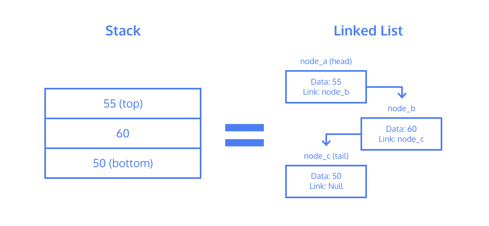

#### STACKS: CONCEPTUAL
# [Stacks Introduction](https://www.codecademy.com/courses/linear-data-structures/lessons/learn-stacks-general/exercises/stacks-general-intro)
A stack is a data structure which contains an ordered set of data.

Stacks provide three methods for interaction:
* **Push** - adds data to the “top” of the stack
* **Pop** - returns and removes data from the “top” of the stack
* **Peek** - returns data from the “top” of the stack without removing it

Stacks mimic a physical “stack” of objects. 
Consider a set of gym weights.

Each plate has a weight (the data). 
The first plate you add, or push, onto the floor is both the bottom and top of the stack. 
Each weight added becomes the new top of the stack.

At any point, the only weight you can remove, or pop, from the stack is the top one. 
You can peek and read the top weight without removing it from the stack.

The last plate that you put down becomes the first, and only, one that you can access. 
This is a **Last In, First Out** or **LIFO structure**. A less frequently used term is First In, Last Out, or FILO.

# [Stacks Implementation](https://www.codecademy.com/courses/linear-data-structures/lessons/learn-stacks-general/exercises/stacks-general-implementation)
Stacks can be implemented using a linked list as the underlying data structure because it’s more efficient than a list or array.

Depending on the implementation, the top of the stack is equivalent to the head node of a linked list and the bottom of the stack is equivalent to the tail node.

A constraint that may be placed on a stack is its size. 
This is done to limit and quantify the resources the data structure will take up when it is “full”.

Attempting to push data onto an already full stack will result in a ***stack overflow***. Similarly, if you attempt to pop data from an empty stack, it will result in a ***stack underflow***.

#### [cheatsheet](https://www.codecademy.com/learn/linear-data-structures/modules/cspath-stacks/cheatsheet)
