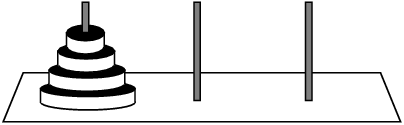

#### LINEAR DATA STRUCTURES
# [Towers of Hanoi](https://www.codecademy.com/courses/linear-data-structures/projects/towers-of-hanoi)
Towers of Hanoi is an ancient mathematical puzzle that starts off with three stacks and many disks.

