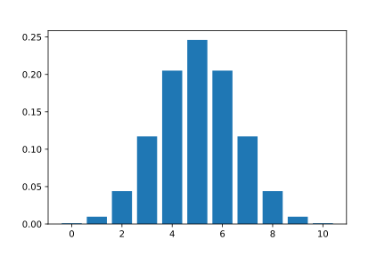
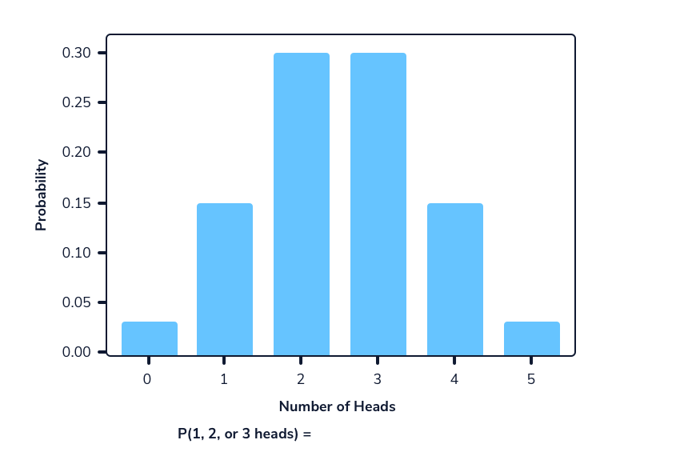

#### INTRODUCTION TO PROBABILITY DISTRIBUTIONS

# [Random Variables](https://www.codecademy.com/courses/probability-mssp/lessons/introduction-to-probability-distributions/exercises/random-variables)

A random variable is, in its simplest form, a function. 
It can equal any possible outcome from the sample space of an event.

Random variables must be numeric, meaning they always take on a number rather than a characteristic or quality. 
For example, when rolling a six-sided fair die, the random variable would be the number (between 1 and 6) from the resulting roll.

If the observed event does not have a numeric outcome, we can assign the random variable to equal 1 if there is a specific outcome and 0 otherwise. 
For example, when observing a fair coin flip, we can assign a “heads” to be the value 1 and a “tails” to be the value 0.

We will be using `random.choice(a, size = size, replace = True/False)` from the `numpy` library to simulate random variables in python. 
In this method:
* `a` is a list or other object that has values we are sampling from
* `size` is a number that represents how many values to  choose
* `replace` will equal either `True` or `False` to represent whether 
  * we will keep a value in a after drawing it (`replace = True`) 
  * or if we remove it from the pool (`replace = False`). 
If we were to roll a die multiple times, we would use `replace = True` because we don’t remove a value after observing it. 
But if we were to draw a card and leave it out of the deck before drawing again, we would do `replace = False`.

The following code simulates the outcome of rolling a fair die twice using `np.random.choice()`:
```py
import numpy as np
 
# 7 is not included in the range function
die_6 = range(1, 7)
 
rolls = np.random.choice(die_6, size = 2, replace = True)
 
print(rolls)
Output:

# [2, 5]
```

# [Discrete and Continuous Random Variables](https://www.codecademy.com/courses/probability-mssp/lessons/introduction-to-probability-distributions/exercises/discrete-and-continuous-random-variables)

## Discrete Random Variables

**When the possible values in a sample space are countable**, the random variable is called a discrete random variable. 
For example, rolling a regular 6-sided die would be considered a discrete random variable because the outcome options are limited to the numbers on the die.

Discrete random variables are also common when observing counting events, such as how many people entered a store on a randomly selected day. 
In this case, the values are countable in that they are limited to whole numbers (you can’t observe half of a person).

## Continuous Random Variables

**When the possible values in a sample space are uncountable**, the random variable is called a continuous random variable. 
These are generally measurement variables and are uncountable because measurements can always be more precise – meters, centimeters, millimeters, etc.

For example, the temperature in Los Angeles on a randomly chosen day is a continuous random variable. 
The temperature measurement can always extend to another decimal place (96 degrees, 96.44 degrees, 96.437 degrees, etc.).

# [Probability Mass Functions](https://www.codecademy.com/courses/probability-mssp/lessons/introduction-to-probability-distributions/exercises/probability-mass-functions)

The probability mass function (PMF) defines the specific probability distribution of the random variable. 
It is used to calculate the probability that a specific event from a discrete random variable occurs. 
For example, a PMF can be used to calculate the probability of rolling a three from a fair six-sided die.

Probability distributions explain the probabilities of observing the possible outcomes of an event. 
There are many different probability distributions. 
Each distribution has its own parameters that describe specific random events. 
You may be familiar with some of these parameters, like the mean and standard deviation, that define some of the most commonly used distributions in statistics.

For example, the distribution for flipping a fair coin ten times and counting the number of heads we observe is called a *binomial distribution*. 
The parameters for the binomial distribution are:
* `n` for the sample size (number of observations, in this case: ten coin flips)
* `p` for the probability of success (probability of seeing our determined outcome, in this case: the probability of seeing heads is 0.5)

This experiment would be classified as a `Binomial(n = 10, p = 0.5)` distribution. 
The graph below shows the probability mass function for this experiment. 
The heights of the bars represent the probability of observing each possible outcome as calculated by the PMF.



**The sum of the heights of all the bars will always equal 1.**

# [Calculating Probabilities using Python](https://www.codecademy.com/courses/probability-mssp/lessons/introduction-to-probability-distributions/exercises/calculating-probabilities-using-python)

The `binom.pmf()` method from the `scipy.stats` library can be used to calculate the probability of observing a specific value in an experiment. 
This method takes 3 values:
* `x`: the value of interest
* `n`: the sample size
* `p`: the probability of success

For example, in our experiment to flip a fair coin 10 times and count the number of heads, 
we can use the probability mass function to calculate the probability of observing a specific number, let’s say 6:
```py
# import necessary library
import scipy.stats as stats
 
# st.binom.pmf(x, n, p)
print(stats.binom.pmf(6, 10, 0.5))
Output:

# 0.205078
```
Notice that two of the three values that go into the `stats.binomial.pmf()` method are the parameters that define the binomial distribution: 
`n` represents the number of trials and `p` represents the probability of success.

# [Using the Probability Mass Function Over a Range](https://www.codecademy.com/courses/probability-mssp/lessons/introduction-to-probability-distributions/exercises/using-the-probability-mass-function-over-a-range)

We have seen that we can calculate the probability of observing a specific value using a probability mass function. 
What if we wanted to find the probability of observing a range of values for a discrete random variable? 
One way we could do this is by adding up the probabilities of each value.

Let’s say we were flipping a fair coin 5 times, and we wanted to know the probability of getting between 1 and 3 heads. 
We can visualize this scenario with the probability mass function:



We can calculate this using the following equation where P(x) is the probability of observing the number x successes:

<div align="center">
    <br />
    <br />
    <br />
    
</div>

# [Probability Mass Function Over a Range using Python](https://www.codecademy.com/courses/probability-mssp/lessons/introduction-to-probability-distributions/exercises/probability-mass-function-over-a-range-using-python)

We can use the same `binom.pmf()` method from the `scipy.stats` library to calculate the probability of observing a range of values. 
As mentioned in a previous exercise, the `binom.pmf` method takes 3 values:
* `x`: the value of interest
* `n`: the sample size
* `p`: the probability of success

We can set up each individual method and sum the resulting values to determine the probability of a range. 
In this case, we are calculating the probability of observing between 2 and 4 heads from 10 coin flips:
```py
import scipy.stats as stats
 
# calculating P(2-4 heads) = P(2 heads) + P(3 heads) + P(4 heads) for flipping a coin 10 times
print(stats.binom.pmf(2, n=10, p=.5) + stats.binom.pmf(3, n=10, p=.5) + stats.binom.pmf(4, n=10, p=.5))
Output:

# 0.366211
We can also calculate the probability of observing less than a certain value, let’s say 3 heads, by adding up the probabilities of the values below it:

import scipy.stats as stats
 
# calculating P(less than 3 heads) = P(0 heads) + P(1 head) + P(2 heads) for flipping a coin 10 times
print(stats.binom.pmf(0, n=10, p=.5) + stats.binom.pmf(1, n=10, p=.5) + stats.binom.pmf(2, n=10, p=.5))
```
Output:
```py
# 0.0546875
```
Note that because our desired range is less than 3 heads, we do not include that value in the summation.

When there are many possible values, this task of summing values can be difficult. 
If we want to know the probability of observing 8 or fewer heads from 10 coin flips, we could add up the values from 0 to 8:
```py
import scipy.stats as stats
 
stats.binom.pmf(0, n = 10, p = 0.5) 
+ stats.binom.pmf(1, n = 10, p = 0.5) 
+ stats.binom.pmf(2, n = 10, p = 0.5) 
+ stats.binom.pmf(3, n = 10, p = 0.5) 
+ stats.binom.pmf(4, n = 10, p = 0.5) 
+ stats.binom.pmf(5, n = 10, p = 0.5) 
+ stats.binom.pmf(6, n = 10, p = 0.5) 
+ stats.binom.pmf(7, n = 10, p = 0.5) 
+ stats.binom.pmf(8, n = 10, p = 0.5)
```
Output:
```py
# 0.98926
```
This involves a lot of repetitive code. 
Instead, we could also use the fact that the sum of all of the possible values is equal to 1 and subtract off the probabilities of higher values:

<div align="center">
    <br />
    
</div>

Now instead of summing up 9 values for the probabilities between 0 and 8 heads, we can do 1 minus the sum of two values and get the same result:
```py
import scipy.stats as stats
# less than or equal to 8
1 - (stats.binom.pmf(9, n = 10, p = 0.5) + stats.binom.pmf(10, n = 10, p = 0.5))
```
Output:
```py
# 0.98926
```

# [Cumulative Distribution Function](https://www.codecademy.com/courses/probability-mssp/lessons/introduction-to-probability-distributions/exercises/cumulative-distribution-function)

The cumulative distribution function for discrete random variables is similar to probability mass functions. 
However, instead of the probability of observing a specific number, 
cumulative distribution functions can be used **to calculate the probability of observing a specific number or less from a given event**.

As previously discussed, the probabilities for all possible values in a given probability distribution add up to 1. 
The value of a cumulative distribution function at a given value is equal to the **sum of the probabilities lower** than it, with a value of 1 for the largest possible number.

Cumulative distribution functions are **constantly increasing**, 
so for two different numbers that the random variable could take on, the value of the function will always be greater for the larger number. 
Mathematically, this is represented as:

<div align="center">
    
</div>

We showed how the probability mass function could be used to 
calculate the probability of observing less than 3 heads out of 10 coin flips by adding up the probabilities of observing 0, 1, and 2 heads. 
The cumulative distribution function produces the same answer by evaluating the function at `CDF(X = 2)`. 
In this case, using the cumulative distribution function would be a simpler method compared to the probability mass function 
because we are making 1 calculation rather than adding together 3 separate calculations.

The animation at the bottom shows the relationship between the probability mass function and the cumulative distribution function. 
The top plot is the PMF, while the bottom plot is the corresponding CDF. 
When looking at the graph of a CDF, each y-axis value is the sum of the probabilities less than or equal to it in the PMF.

<a href="https://static-assets.codecademy.com/skillpaths/master-stats-ii/probability-distributions/cdf-vs-pmf/animated.html">
 
</a>

# [Cumulative Distribution Function continued](https://www.codecademy.com/courses/probability-mssp/lessons/introduction-to-probability-distributions/exercises/cumulative-distribution-function-continued)

We can use a cumulative distribution function to calculate the probability of a specific range 
by taking the difference between two values from the cumulative distribution function. 
For example, to find the probability of observing between 3 and 6 heads, 
we can take the probability of observing 6 or fewer heads and subtracting the probability of observing 2 or fewer heads. 
This leaves a remnant of between 3 and 6 heads.

The visual at the bottom demonstrates how this works. 

<a href="https://static-assets.codecademy.com/skillpaths/master-stats-ii/probability-distributions/cdf-animation/animation.html">
 
</a>

It is important to note that to include the lower bound in the range, the value being subtracted should be one less than the lower bound. 
In this example, we wanted to know the probability from 3 to 6, which includes 3. 
Mathematically, this looks like the following equation:

<div align="center">
    <br />
    or <br />
    
</div>

# [Using the Cumulative Distribution Function in Python](https://www.codecademy.com/courses/probability-mssp/lessons/introduction-to-probability-distributions/exercises/using-the-cumulative-distribution-function-in-python)

We can use the `binom.cdf()` method from the `scipy.stats` library to calculate the cumulative distribution function. 
This method takes 3 values:
* `x`: the value of interest, looking for the probability of this value or less
* `n`: the sample size
* `p`: the probability of success

Calculating the probability of observing 6 or fewer heads from 10 fair coin flips (0 to 6 heads) mathematically looks like the following:

<div align="center">
    
</div>


