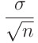
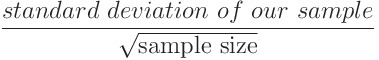

#### SAMPLING DISTRIBUTIONS

# [Sampling from a Population](https://www.codecademy.com/courses/probability-mssp/lessons/sampling-distributions-mssp/exercises/sample-data)

In statistics, we often want to learn about a large population. 
Since collecting data for an entire population is often impossible, researchers may use a smaller sample of data to try to answer their questions.

To do this, a researcher might calculate a statistic such as mean or median for a sample of data. 
Then they can use that statistic as an estimate for the population value they really care about.

For example, suppose that a researcher wants to know the average weight of all Atlantic Salmon fish. 
It would be impossible to catch every single fish. 
Instead, the researchers might collect a sample of 50 fish off the coast of Alaska and determine that the average weight of those fish is x. 
If the same researchers collected 50 new fish and took the new average weight, that average would likely be slightly different than the first sample average.

Over the course of this lesson, we will go over how we can extrapolate from sample data in order to describe our uncertainty about the statistics of the full population.

# [Random Sampling in Python](https://www.codecademy.com/courses/probability-mssp/lessons/sampling-distributions-mssp/exercises/sample-data-in-python)

Now that we’ve generated some random samples from a population using an applet, let’s code this ourselves in Python. 
The `numpy.random` package has several functions that we could use to simulate random sampling. 
In this exercise, we’ll use the function `np.random.choice()`, which generates a sample of some size from a given array.

In the example code, we’ll pretend that we’re all-powerful and actually have a list of all the weights of Atlantic Salmon that currently exist.

In the example code in randomSampling.py, we have done the following:

* Loaded in the weights of all salmon into a dataframe called `population`.
* Plotted the distribution of `population` and calculated the mean.
* Used `np.random.choice()` function to generate a sample called sample of size 30 (`samp_size` variable is equal to `30`).

# [Sampling Distributions](https://www.codecademy.com/courses/probability-mssp/lessons/sampling-distributions-mssp/exercises/sampling-distributions)

As we saw in the last example, each time we sample from a population, we will get a slightly different sample mean. 
In order to understand how much variation we can expect in those sample means, we can do the following:
* Take a bunch of random samples of fish, each of the same size (50 fish in this example)
* Calculate the sample mean for each one
* Plot a histogram of all the sample means

This process gives us an estimate of the sampling distribution of the mean for a sample size of 50 fish.

The code to accomplish this is shown below:
```py
salmon_population = population['Salmon_Weight']
 
sample_size = 50
sample_means = []
 
# loop 500 times to get 500 random sample means
for i in range(500):
  # take a sample from the data:
  samp = np.random.choice(salmon_population, sample_size, replace = False)
  # calculate the mean of this sample:
  this_sample_mean = np.mean(samp)
  # append this sample mean to a list of sample means
  sample_means.append(this_sample_mean)
 
# plot all the sample means to show the sampling distribution
sns.histplot(sample_means, stat='density')
plt.title("Sampling Distribution of the Mean")
plt.show()
```
The distribution of the `sample_means` looks like this:


This is a sampling distribution with a sample of 500. The distribution is centered around x=60 and looks fairly symmetrical.

Note that we can look at a sampling distribution for any statistic. 
For example, we could estimate the sampling distribution of the maximum by calculating the maximum of each sample, rather than the mean (as shown above).

# [Central Limit Theorem](https://www.codecademy.com/courses/probability-mssp/lessons/sampling-distributions-mssp/exercises/central-limit-theorem)

So far, we’ve defined the term sampling distribution and shown how we can simulate an approximated sampling distribution for a few different statistics 
(mean, maximum, variance, etc.). 
The ***Central Limit Theorem (CLT)*** allows us to specifically describe the sampling distribution of the mean.

The CLT states that the sampling distribution of the mean is normally distributed as long as the population is not too skewed or the sample size is large enough. 
Using a sample size of n > 30 is usually a good rule of thumb, regardless of what the distribution of the population is like. 
If the distribution of the population is normal, the sample size can be smaller than that.

Let’s take another look at the salmon weight to see how the CLT applies here. 
The first plot below shows the population distribution. 
The salmon weight is skewed right, meaning the tail of the distribution is longer on the right than on the left.


This graph shows the distribution of salmon weights across the entire population. The distribution is right-skewed as it ranges from 0 to almost 300 pounds.

Next, we’ve simulated a sampling distribution of the mean (using a sample size of 100) and super-imposed a normal distribution on top of it. 
Note how the estimated sampling distribution follows the normal curve almost perfectly.


This graph shows the sampling distribution of salmon weights across a sample size of 50. 
The sampling distribution is approximately normal, despite the population distribution being right-skewed, showcasing one of the key ideas behind the central limit theorem.

Note that the CLT only applies to the sampling distribution of the mean and not other statistics like maximum, minimum, and variance!

# [CLT Continued](https://www.codecademy.com/courses/probability-mssp/lessons/sampling-distributions-mssp/exercises/clt-continued)

Now that we’ve examined the CLT from a high level, let’s get into the details.

The CLT not only establishes that the sampling distribution will be normally distributed, but it also allows us to describe that normal distribution quantitatively. 
Normal distributions are described by their mean `μ` (mu) and standard deviation `σ` (sigma).

Let’s break this up:
* We take samples of size n from a population (that has a true population mean `μ` and standard deviation of `σ`) and calculate the sample mean `x`.
* Given that n is sufficiently large (n > 30), the sampling distribution of the means will be normally distributed with:
    * mean `x` approximately equal to the population mean `μ`
    * standard deviation equal to the population standard deviation divided by the square root of the sample size. We can write this out as:
    	 

We’ll focus on the first point in this exercise and the second point in the next exercise.

As an example of this, let’s look again at our salmon fish population. 
Last exercise, we saw that the sampling distribution of the mean was normally distributed. 
In the plot below, we can see that the mean of the simulated sampling distribution is approximately equal to the population mean.

	 

This graph shows the distribution of salmon weights across the entire population. 
The mean is at about 60.7 pounds. 
The distribution is right-skewed as it ranges from 0 to almost 300 pounds.

	

This graph shows the sampling distribution of salmon weights across a sample size of 50. 
The mean is at about 60.8 pounds which is almost identical to the population mean. 
The sampling distribution is also approximately normal showcasing both key ideas behind the central limit theorem.

In the workspace, we’ve simulated a sampling distribution of the mean using a sample size of 50.

# [Standard Error](https://www.codecademy.com/courses/probability-mssp/lessons/sampling-distributions-mssp/exercises/standard-error)

The second part of the Central Limit Theorem is:

The sampling distribution of the mean is normally distributed, with standard deviation equal to the **population standard deviation** 
(often denoted as the greek letter, sigma) **divided by the square root of the sample size** (often denoted as n):

	

The standard deviation of a sampling distribution is also known as the **standard error of the estimate of the mean**. 
In many instances, we cannot know the population standard deviation, so we estimate the standard error using the sample standard deviation:

	

Two important things to note about this formula is that:
* As **sample size increases**, the **standard error** will **decrease**.
* As the population **standard deviation increases, so will the standard error**.

# [Biased Estimators](https://www.codecademy.com/courses/probability-mssp/lessons/sampling-distributions-mssp/exercises/biased-estimators)

According to the Central Limit Theorem, the mean of the sampling distribution of the mean is equal to the population mean. 
This is the case for some, but not all, sampling distributions. 
Remember, you can have a sampling distribution for any sample statistic, including:
* mean
* median
* max / min
* variance
Because the mean of the sampling distribution of the mean is equal to the mean of the population, we call it an unbiased estimator. 
A statistic is called an unbiased estimator of a population parameter if the mean of the sampling distribution of the statistic is 
equal to the value of the statistic for the population.

The maximum is one example of a biased estimator, meaning that the mean of the sampling distribution of the maximum is not centered at the population maximum.

# [Calculating Probabilities](https://www.codecademy.com/courses/probability-mssp/lessons/sampling-distributions-mssp/exercises/calculating-probabilities)

Once we know the sampling distribution of the mean, we can also use it to estimate the probability of observing a particular range of sample means, 
given some information (either known or assumed) about the population. 
To do this, we can use the ***Cumulative Distribution Function***, or ***(CDF)*** of the normal distribution.

Let’s work through this with our salmon fish example. 
Let’s say we are transporting the salmon and want to make sure the crate we carry the fish in will be strong enough to hold the weight.
* Suppose we estimate that the salmon population has an **average weight** of 60 lbs with a **standard deviation** of 40 lbs.
* We have a crate that supports 750 lbs, and we want to be able to transport 10 fish at a time.
* We want to **calculate the probability** that the average weight of those 10 fish is less than or equal to 75 (750/10).

Using the CLT, we first estimate that the mean weight of 10 randomly sampled salmon from this population is normally distributed with mean = 60 and standard error = (40^2)/10. Then, we can use this probability distribution to calculate the probability that 10 randomly sampled fish will have a mean weight less than or equal to 75.
```py
x = 75
mean = 60
std_dev = 40
samp_size = 10
standard_error = std_dev / (samp_size**.5)
# remember that **.5 is raising to the power of one half, or taking the square root
 
stats.norm.cdf(x,mean,standard_error)
```
This returns 0.882, or a probability of 88.2% that the average weight of our sample of 10 fish will be less than or equal to 75.

# [Review](https://www.codecademy.com/courses/probability-mssp/lessons/sampling-distributions-mssp/exercises/review)

Let’s recap what we’ve learned in this lesson:
* A sampling distribution is obtained by taking a random sample of a certain size multiple times, taking a sample statistic, and plotting the distribution of this sample statistic.
* The Central Limit Theorem establishes that the sampling distribution of the mean will be normally distributed (even if the original population was not normally distributed).
* A statistic is called an unbiased estimator of a population parameter if the mean of the sampling distribution of the statistic is equal to the value of the statistic for the population. The mean is an unbiased estimator.
* We can use the Standard Error of our sample mean distribution in order to calculate probabilities of obtaining a sample with a certain statistic using the CDF.


