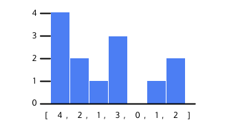
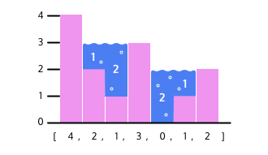

#### TECHNICAL INTERVIEW PRACTICE WITH PYTHON

# [Capturing Rain Water](https://www.codecademy.com/courses/technical-interview-practice-python/projects/rain-water)

A histogram is a chart which consists of a series of bars. 
A Python list can represent a histogram by containing integers, each of which represents the height of a single bar.

The list `[4, 2, 1, 3, 0, 1, 2]` would represent the following histogram:

For our problem, imagine that rainwater has fallen over the histogram and collected between the bars. 
Here’s how the previous histogram would look filled with water:

We need to write a function which calculates the total water captured from an input of a list of integers.

Our function would return 6 from the previous example.

Throughout this project, run your code by saving it in the text editor, then typing python3 script.py in the terminal and pressing enter.

If you get stuck during this project, check out the project walk-through video which ca
